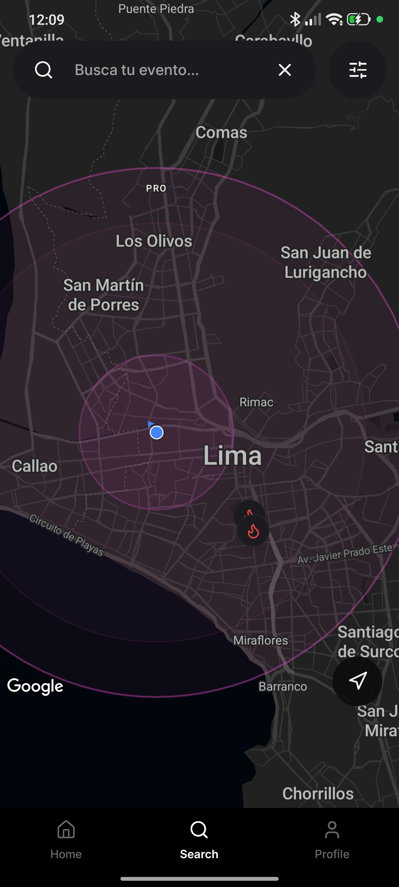
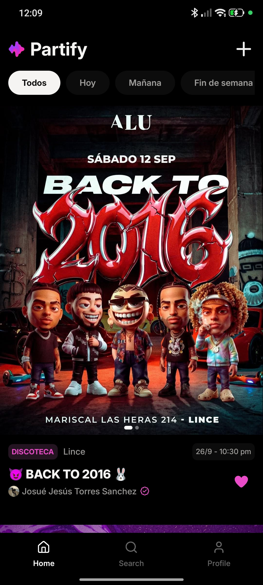
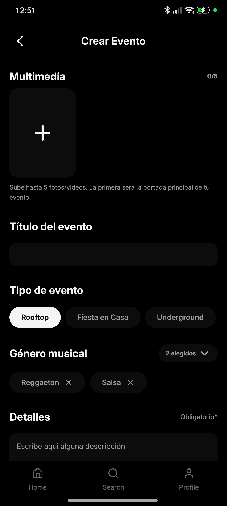
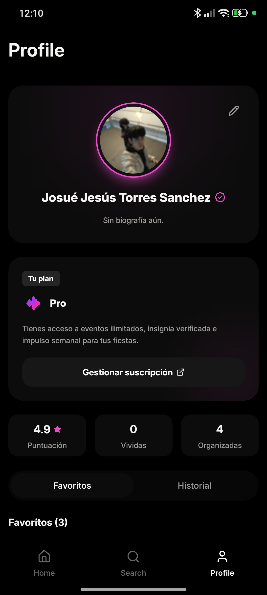

# Partify Mobile

> A location-based social event discovery and party curation mobile application built with React Native and Expo.

Partify solves the friction, fragmented information, and high ticketing fees associated with traditional nightlife platforms. It connects night owls, attendees, and partygoers directly with independent hosts and local venues through real-time geospatial discovery. By offering direct host communication via WhatsApp and external ticketing integration, Partify operates on a zero-commission model for ticketing while providing hosts with subscription-based management tools.

The application interacts with a dedicated REST API service hosted in the [partify-backend](https://github.com/urjos/partify-backend) repository (Node.js, Express, MongoDB).

---

## Demo

<!-- TODO: add demo video or TestFlight/APK link -->

https://github.com/urjos/partify/releases/download/v1.0.0/partify_1.1.0.apk

---

## Screenshots

<!-- Place screenshots in docs/screenshots/ with 320px width for optimal readability -->

|               Geospatial Radar & Map               |               Feed & Category Filters                |                 Event Details & Media                  |
| :------------------------------------------------: | :--------------------------------------------------: | :----------------------------------------------------: |
|  |  |  |

|                 Event Creation Wizard                 |                User Profile & Host Plans                 | 
| :---------------------------------------------------: | :------------------------------------------------------: |
|  |  |


---

## Features

- **Geospatial Radar & Map Exploration:** Interactive Google Maps integration with custom dark mode styling, GPS location tracking, and real-time distance calculations via Haversine formula.
- **Dynamic Event Feed:** Chronological listings with temporal filters (Today, Tomorrow, Weekend, Nearby) and category taxonomy (Rooftops, Underground, House Parties, Clubs).
- **Rich Media Carousels:** Supports mixed media items including high-resolution images and autoplaying looping videos using `expo-video` (`useVideoPlayer`).
- **Zero-Commission Host Contact:** Deep links directly into WhatsApp with pre-filled event inquiry templates, or directs to external ticketing links (Passline, Eventbrite).
- **Social RSVP & Engagement:** Instant attendance toggling (_Going_, _Interested_), community star ratings (1 to 5), and favorite bookmarking.
- **Event Creation & Pin Location Picker:** Dedicated form with reverse geocoding via `expo-location`, media uploads to Supabase Storage, and Peruvian phone number formatting and validation.
- **Authentication & Secure Storage:** Email/password and Google OAuth authentication flows powered by Clerk, storing session tokens natively with `expo-secure-store`.
- **Tiered Host Subscriptions (Clerk Billing):** Free plan (limited to 2 active events) and Pro plan (unlimited events, weekly event boost, verified host badge) managed via Clerk's Account Portal.
- **Telemetry & Error Tracking:** Screen views and user interactions tracked cleanly through PostHog React Native SDK.

---

## Tech Stack

| Category             | Technology                                                                                    | Version                  | Purpose                                                          |
| :------------------- | :-------------------------------------------------------------------------------------------- | :----------------------- | :--------------------------------------------------------------- |
| **Framework**        | [Expo](https://expo.dev)                                                                      | `~54.0.35`               | Universal React platform with New Architecture enabled           |
| **Runtime**          | [React Native](https://reactnative.dev)                                                       | `0.81.5`                 | Native mobile foundation                                         |
| **Language**         | [TypeScript](https://www.typescriptlang.org)                                                  | `~5.9.2`                 | Static typing and interfaces                                     |
| **Routing**          | [Expo Router](https://docs.expo.dev/router/introduction/)                                     | `~6.0.24`                | File-based navigation, typed routes, modal stacks                |
| **Styling**          | [NativeWind](https://www.nativewind.dev) / [Tailwind CSS](https://tailwindcss.com)            | `^5.0.0-rc.0` / `^4.3.3` | Utility-first styling engine compiled via PostCSS                |
| **State Management** | [Zustand](https://github.com/pmndrs/zustand)                                                  | `5.0.3`                  | Global state stores for events, location picking, and user state |
| **Authentication**   | [Clerk Expo](https://clerk.com/docs/quickstarts/expo)                                         | `^4.2.8`                 | Auth flows, Google OAuth, session token management               |
| **Monetization**     | [Clerk Billing](https://clerk.com/docs/billing)                                               | Built-in                 | Subscription tiers, feature gating, and billing portal           |
| **Maps & Location**  | [react-native-maps](https://github.com/react-native-maps/react-native-maps) / `expo-location` | `1.20.1` / `~19.0.8`     | Google Maps rendering, geolocation, reverse geocoding            |
| **Media & Video**    | [expo-video](https://docs.expo.dev/versions/latest/sdk/video/) / `expo-image-picker`          | `~3.0.16` / `~17.0.11`   | Native video playback and camera roll photo selection            |
| **Cloud Storage**    | [@supabase/supabase-js](https://supabase.com)                                                 | `^2.116.0`               | CDN storage buckets for event media and user avatars             |
| **Analytics**        | [PostHog React Native](https://posthog.com/docs/libraries/react-native)                       | `^4.63.2`                | Screen telemetry and interaction event capturing                 |
| **Build & CI**       | [EAS Build](https://expo.dev/eas)                                                             | CLI `>= 20.5.1`          | Native compilation profiles for development and release          |
| **Backend API**      | [Partify Backend](https://github.com/urjos/partify-backend)                                   | REST v1                  | Express, MongoDB Atlas (`2dsphere`), Arcjet rate-limiting        |

---

## Project Structure

```
partify/
├── app/                        # Expo Router file-based route definitions
│   ├── (auth)/                 # Unauthenticated routes (sign-in, sign-up)
│   ├── (events)/               # Event detail and edit routes ([id].tsx)
│   ├── (tabs)/                 # Main bottom navigation tabs
│   │   ├── index.tsx           # Home feed screen with category filters
│   │   ├── search.tsx          # Geospatial radar map screen
│   │   ├── create.tsx          # Host event creation screen
│   │   └── profile.tsx         # User profile and subscription manager
│   ├── (user)/                 # User profile view and edit screens
│   ├── subscriptions/          # Subscription details route
│   ├── create-location.tsx     # Fullscreen map pin location picker modal
│   └── _layout.tsx             # Root layout: Clerk, PostHog, Font providers
├── assets/                     # Icons, static images, fonts, and screenshots
├── components/                 # Modular UI components organized by domain
│   ├── auth/                   # Form inputs and social login buttons
│   ├── event/                  # Event cards, media carousel, forms, detail cards
│   ├── home/                   # Header, host banner, category filter chips
│   ├── profile/                # Profile cards, avatar section, music vibe editor
│   ├── search/                 # Radar map controls, search filter modals
│   ├── shared/                 # Skeletons, loading screens, separators
│   └── subscription/           # UpgradeToProModal and feature comparison items
├── constants/                  # Theme colors, category schemas, map dark styles
├── hooks/                      # Custom hooks (useApi, useBilling, useColorScheme)
├── lib/                        # Infrastructure and utility libraries
│   ├── api/                    # HTTP client with Clerk JWT interceptor & mappers
│   ├── billing/                # Subscription plans, features, and active limits
│   ├── store/                  # Zustand stores (eventStore, locationPickerStore, userStore)
│   ├── storage.ts              # Supabase storage client for media and avatars
│   ├── utils.ts                # Currency, phone, and date formatting utilities
│   └── whatsapp.ts             # Pre-configured WhatsApp deep-linking helpers
├── src/config/                 # PostHog client configuration
├── app.config.js               # Dynamic Expo configuration and native plugins
└── eas.json                    # Expo Application Services build configurations
```

---

## Getting Started

### Prerequisites

- **Node.js**: `v20.x` or higher
- **npm**: `v10.x` or higher
- **Android Studio** (with Android SDK and emulator configured) or **Xcode** (macOS, for iOS simulator)
- **EAS CLI** (optional, for cloud builds): `npm install -g eas-cli`

> [!IMPORTANT]
> **Expo Go vs. Development Client:**
> This project relies on custom native libraries and plugins (`react-native-maps` with Google Maps SDK, `expo-video`, `@clerk/expo` native modules, and React Native New Architecture).
> It **cannot** run on standard Expo Go. You must use a **Development Build** (`npx expo run:android` / `npx expo run:ios`) or generate a development client APK using EAS Build.

### 1. Clone the Repository

```bash
git clone https://github.com/urjos/partify.git
cd partify
```

### 2. Install Dependencies

```bash
npm install
```

_(Dependency resolution has been verified on npm v10; no `--legacy-peer-deps` flag is required)._

### 3. Configure Environment Variables

Create a `.env` file in the project root based on [`.env.example`](file:///.env.example):

```bash
cp .env.example .env
```

| Variable                            |  Required  | Description                                                                         | Where to Obtain                                                                                            |
| :---------------------------------- | :--------: | :---------------------------------------------------------------------------------- | :--------------------------------------------------------------------------------------------------------- |
| `EXPO_PUBLIC_CLERK_PUBLISHABLE_KEY` |  **Yes**   | Clerk publishable API key for authentication and billing.                           | [Clerk Dashboard](https://dashboard.clerk.com) > API Keys                                                  |
| `EXPO_PUBLIC_API_URL`               |  **Yes**   | Base endpoint URL for the backend REST API (must point to `/api/v1`).               | Local backend server (e.g. `http://<LAN-IP>:5500/api/v1` or ngrok) or deployed backend instance            |
| `EXPO_PUBLIC_SUPABASE_URL`          |  **Yes**   | Supabase project URL for hosting images and videos.                                 | [Supabase Dashboard](https://supabase.com/dashboard) > Project Settings > API                              |
| `EXPO_PUBLIC_SUPABASE_ANON_KEY`     |  **Yes**   | Supabase public anonymous key for storage uploads.                                  | [Supabase Dashboard](https://supabase.com/dashboard) > Project Settings > API                              |
| `EXPO_PUBLIC_GOOGLE_MAPS_API_KEY`   |  **Yes**   | Google Maps SDK API key for Android native map rendering.                           | [Google Cloud Console](https://console.cloud.google.com) > APIs & Services (Enable _Maps SDK for Android_) |
| `POSTHOG_PROJECT_TOKEN`             | Optional\* | Project token for PostHog event tracking (\*required in `__DEV__` unless disabled). | [PostHog Cloud](https://us.posthog.com) > Project Settings                                                 |
| `POSTHOG_HOST`                      |  Optional  | PostHog ingestion host (defaults to `https://us.i.posthog.com`).                    | [PostHog Cloud](https://us.posthog.com) > Project Settings                                                 |

### 4. Run the Development Client

Compile native dependencies and launch the development build on your connected device or emulator:

#### Android

```bash
npx expo run:android
```

#### iOS (macOS required)

```bash
npx expo run:ios
```

Once the native binary is built on your device or emulator, start the Metro bundler:

```bash
npx expo start
```

---

## Available Scripts

The following scripts are defined in [`package.json`](file:///package.json):

| Command                 | Description                                                                   |
| :---------------------- | :---------------------------------------------------------------------------- |
| `npm run start`         | Starts the Expo Metro development server.                                     |
| `npm run android`       | Starts Metro and attempts to open on an Android connected device or emulator. |
| `npm run ios`           | Starts Metro and attempts to open on an iOS simulator.                        |
| `npm run web`           | Starts the web development bundler.                                           |
| `npm run lint`          | Runs ESLint verification across project files using `expo lint`.              |
| `npm run reset-project` | Executes Expo helper script to reset boilerplate starter code.                |

---

## Deployment

The mobile application is built using Expo Application Services (EAS Build) as specified in [`eas.json`](file:///eas.json):

| Profile       | Distribution | Target Binary  | Purpose                                                                      |
| :------------ | :----------- | :------------- | :--------------------------------------------------------------------------- |
| `development` | Internal     | Android `.apk` | Debugging build bundling `expo-dev-client` for physical device testing.      |
| `preview`     | Internal     | Android `.apk` | Standalone release build for internal stakeholders without dev client tools. |
| `production`  | Store        | Android `.aab` | Optimized production bundle configured with auto-incrementing version codes. |

Trigger an EAS build with:

```bash
eas build --profile preview --platform android
```

### Backend Deployment

The backend service is managed separately in [partify-backend](https://github.com/urjos/partify-backend) and deployed to platforms such as Render. The mobile client communicates exclusively with the backend via `EXPO_PUBLIC_API_URL`.

---

## Known Limitations & Roadmap

- **Automated Test Suite:** There is currently no configured test runner (Jest, React Native Testing Library, or Detox) in the repository. Adding unit tests for Zustand stores and integration tests for auth flows is planned on the roadmap.
- **Direct Messaging (In-App Chat):** Direct messaging currently deep-links to WhatsApp (`wa.me`) or redirects to third-party ticket URLs. An in-app WebSocket chat is planned for subsequent releases.
- **Subscription Checkout Presentation:** Upgrades to Partify Pro redirect to Clerk's hosted web Account Portal via in-app browser (`expo-web-browser`) rather than an embedded native payment sheet.
- **Explicit Package Manifest Entry:** `zustand` is actively utilized across `lib/store/` but is currently resolved via transitive resolution or the lockfile; pinning it explicitly in `package.json` dependencies is recommended.
- **iOS Configuration:** Android is currently the primary target with native Google Maps configuration. iOS builds require provisioning certificates and native map provider setup in `app.config.js`.

---

## Author

Developed by **urjos** — [GitHub Profile](https://github.com/urjos)

- Mobile Repository: [github.com/urjos/partify](https://github.com/urjos/partify)
- Backend Repository: [github.com/urjos/partify-backend](https://github.com/urjos/partify-backend)
